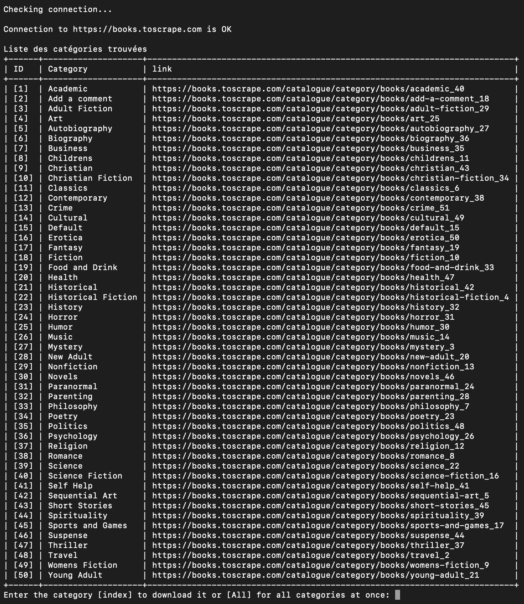
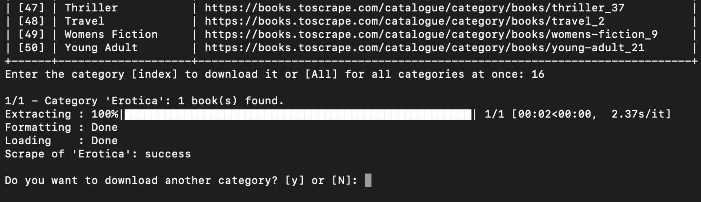

<h1 align="center">BooksToScrape</h1>

    

<h4 align="center">OpenClassRooms Projet 2</h4>

    <em>Testé sous MacOS 12.6 - Python version 3.10.6</em>

## Table des matières

1. [Windows](#id-section1)
2. [MacOS et Linux](#id-section2)
3. [Exemples d'affichage](#section3)

## 1. Windows :
Dans Windows Powershell, naviguer vers le dossier souhaité.
###### Récupération du projet

    $ git clone https://github.com/damigarn/OCR_P02_BooksToScrape.git

###### Activer l'environnement virtuel
    $ cd OCR_P02_BooksToScrape 
    $ python -m venv env 
    $ ~env\scripts\activate
    
###### Installer les paquets requis
    $ pip install -r requirements.txt

###### Lancer le programme
    $ python main.py

---------

## 2. MacOS et Linux :
Dans le terminal, naviguer vers le dossier souhaité.
###### Récupération du projet

    $ git clone https://github.com/damigarn/OCR_P02_BooksToScrape.git

###### Activer l'environnement virtuel
    $ cd OCR_P02_BooksToScrape
    $ python3 -m venv env
    $ source env/bin/activate
    
###### Installer les paquets requis
    $ pip install -r requirements.txt

###### Lancer le programme
    $ python3 main.py

---------

## 3. Exemple d'affichage :

#### Lancement de l'application :

#### Téléchargement :
